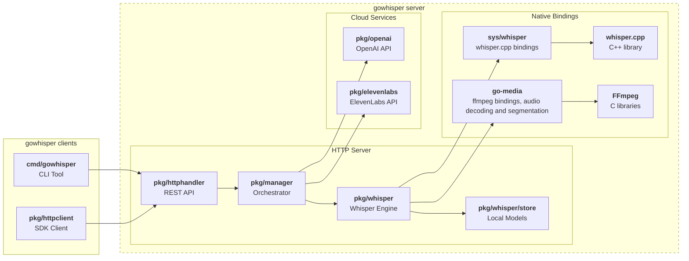

# go-whisper

[](https://pkg.go.dev/github.com/mutablelogic/go-whisper)
[](LICENSE)

A unified speech-to-text and translation service that provides a single API for multiple providers:

- **Local Models**: High-performance transcription using [whisper.cpp](https://github.com/ggerganov/whisper.cpp) with GPU acceleration
- **Commercial Models**: Cloud-based transcription using OpenAI Whisper and ElevenLabs APIs with advanced features like speaker diarization

## Features

- **Command Line Interface**: Downloadable CLI for communicating with the server for  audio processing
- **Download and Realtime Transcription** with JSON, SRT, VTT, and text output formats
- **HTTP API Server**: RESTful API for transcription and translation service
- **Docker Support**: Pre-built GPU-enabled containers for easy deployment of the service
- **GPU Support**: CUDA, Vulkan, and Metal (macOS) acceleration for local models
- **Model Management**: Download, cache, and manage models locally

## Quick Start

Get started quickly with Docker as the server:

```bash
# Set API keys for commercial providers (optional)
export OPENAI_API_KEY="your-key-here"
export ELEVENLABS_API_KEY="your-key-here"

# Start the CPU-only server
docker volume create whisper
docker run -d --name whisper-server \
  --env OPENAI_API_KEY --env ELEVENLABS_API_KEY \
  -v whisper:/data -p 8081:8081 \
  ghcr.io/mutablelogic/go-whisper run
```

You'll then need to run the gowhisper CLI to interact with the server. Download it from [GitHub Releases](https://github.com/mutablelogic/go-whisper/releases) or [build from source](doc/build.md):

```bash
# Set the server address for CLI commands
export GOWHISPER_ADDR="localhost:8081"

# Download a local model
gowhisper download ggml-medium-q5_0.bin

# Transcribe with local model to SRT
gowhisper transcribe ggml-medium-q5_0 your-audio.wav --format srt

# Or use OpenAI (requires OPENAI_API_KEY)
gowhisper transcribe whisper-1 your-audio.wav
```

The following sections provide detailed information about deployment, CLI usage, and building from source. For HTTP API documentation, see the [API Reference](doc/API.md).

## Model Support

Available local models can be downloaded from [Hugging Face](https://huggingface.co/ggerganov/whisper.cpp) using the `gowhisper download-model` command.

- *Transcription* is the process of converting spoken language into written text, in any language supported by the model.
- *Translation* is the process of converting spoken language into written text in English, regardless of the original language.
- *Diarization* is the process of identifying and separating different speakers in an audio recording.
- *Realtime* processing allows for transcription or translation of audio streams to be returned as it is being processed, rather than waiting for the entire audio file to be processed before returning results.

| Model(s) | Transcription | Translation to English | Diarization | Realtime |
|----------|---------------|-------------|-------------|-----------|
| GGML Whisper `*-en.bin` | ✅ |  |  | ✅ |
| GGML Whisper `*.bin` | ✅ | ✅ |  | ✅ |
| GGML Whisper `ggml-small.en-tdrz.bin`[^1] | ✅ |  | ✅ | ✅ |
| OpenAI `whisper-1` [^2] | ✅ | ✅ |  | |
| OpenAI `gpt-4o-*-transcribe` [^4],[^5] | ✅ | |  | ✅ |
| ElevenLabs `scribe_v1`,`scribe_v2` [^3] | ✅ |  |  ✅ | |

[^1]: <https://huggingface.co/akashmjn/tinydiarize-whisper.cpp>
[^2]: <https://platform.openai.com/docs/models/whisper-1>
[^3]: <https://elevenlabs.io/docs/models#scribe-v1>
[^4]: <https://platform.openai.com/docs/models/gpt-4o-transcribe>
[^5]: <https://platform.openai.com/docs/models/gpt-4o-mini-transcribe>

## Docker Deployment

Docker containers [are available](https://github.com/orgs/mutablelogic/packages?repo_name=go-whisper) for AMD64, ARM64 architectures for Linux, in two variants which are compatible with Vulkan and CUDA GPU's. For detailed Docker deployment instructions, including GPU support, environment configuration, and production setup, see the [Docker Guide](doc/docker.md).

## CLI Usage Examples

The `gowhisper` CLI tool provides a unified interface for all providers.

| Command | Description | Example |
|---------|-------------|---------|
| `models` | List all available models | `gowhisper models` |
| `model` | Get information about a specific model | `gowhisper model ggml-medium-q5_0` |
| `download-model` | Download a model | `gowhisper download-model ggml-medium-q5_0.bin` |
| `delete-model` | Delete a local model | `gowhisper delete-model ggml-medium-q5_0` |
| `transcribe` | Transcribe audio with local model | `gowhisper transcribe ggml-medium-q5_0 samples/jfk.wav` |
| `transcribe` | Transcribe with OpenAI (requires API key) | `gowhisper transcribe whisper-1 samples/jfk.wav` |
| `transcribe` | Transcribe with ElevenLabs diarization | `gowhisper transcribe scribe_v1 samples/meeting.wav --format srt --diarize` |
| `translate` | Translate to English with local model | `gowhisper translate ggml-medium-q5_0 samples/de-podcast.wav` |
| `translate` | Translate with OpenAI | `gowhisper translate whisper-1 samples/de-podcast.wav` |
| `run` | Run the server | `gowhisper run --http.addr localhost:8081` |

Use `gowhisper --help` or `gowhisper <command> --help` for more options and detailed usage information.

## Development

### Project Structure

- `cmd` contains the command-line tool, which can also be run as an OpenAPI-compatible HTTP server
- `pkg` contains the `whisper` service and client:
  - [`whisper/`](https://pkg.go.dev/github.com/mutablelogic/go-whisper/pkg/whisper) - Core whisper.cpp bindings and local transcription
  - [`openai/`](https://pkg.go.dev/github.com/mutablelogic/go-whisper/pkg/openai) - OpenAI Whisper API client integration
  - [`elevenlabs/`](https://pkg.go.dev/github.com/mutablelogic/go-whisper/pkg/elevenlabs) - ElevenLabs API client integration
  - [`httpclient/`](https://pkg.go.dev/github.com/mutablelogic/go-whisper/pkg/httpclient) - HTTP client utilities
  - [`httphandler/`](https://pkg.go.dev/github.com/mutablelogic/go-whisper/pkg/httphandler) - HTTP server handlers and routing
  - [`schema/`](https://pkg.go.dev/github.com/mutablelogic/go-whisper/pkg/schema) - API schema definitions and types
  - [`manager.go`](https://pkg.go.dev/github.com/mutablelogic/go-whisper/pkg) - Service orchestration and provider routing
- `sys` contains the [bindings](https://pkg.go.dev/github.com/mutablelogic/go-whisper/sys/whisper) to the `whisper.cpp` library
- `third_party` is a submodule for the whisper.cpp source, and ffmpeg bindings

### Architecture

This diagram shows the relationship between clients, the go-whisper server, and backend services.



### Building

For detailed build instructions, see the [Build Guide](doc/build.md). This covers:

- Building Docker images with CUDA or Vulkan support
- Building from source on macOS (Metal), Linux (CUDA/Vulkan), and other platforms
- Installing dependencies for each platform
- Building the client-only binary

For Docker deployment and GPU configuration, see the [Docker Guide](doc/docker.md).

## Contributing & License

This project is currently in development and subject to change. Please file feature requests and bugs
in the [GitHub issues](https://github.com/mutablelogic/go-whisper/issues).
The license is Apache 2 so feel free to redistribute. Redistributions in either source
code or binary form must reproduce the copyright notice, and please link back to this
repository for more information:

> **go-whisper**\
> [https://github.com/mutablelogic/go-whisper/](https://github.com/mutablelogic/go-whisper/)\
> Copyright (c) David Thorpe, All rights reserved.
>
> **whisper.cpp**\
> [https://github.com/ggerganov/whisper.cpp](https://github.com/ggerganov/whisper.cpp)\
> Copyright (c) The ggml authors
>
> **go-media**\
> [https://github.com/mutablelogic/go-media/](https://github.com/mutablelogic/go-media/)
> Copyright (c) 2021-2026 David Thorpe, All rights reserved.
>
> **ffmpeg**\
> [https://ffmpeg.org/](https://ffmpeg.org/)\
> Copyright (c) the FFmpeg developers

This software links to static libraries of [whisper.cpp](https://github.com/ggerganov/whisper.cpp) licensed under
the [MIT License](https://opensource.org/licenses/MIT). This software links to static libraries of ffmpeg licensed under the
[LGPL 2.1 License](http://www.gnu.org/licenses/old-licenses/lgpl-2.1.html).
